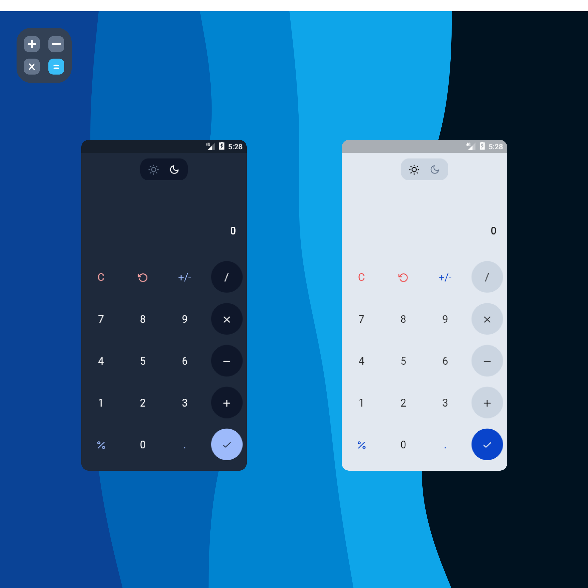

# `Calculator`

## A Calculator app written in flutter.

## About

A Calculator App made using Flutter. This was made as an exercise and to learn Flutter (and Dart) in general. The code is (probably) not up to standards and the app itself is very limited in functionality. 

## Downloads

[Android](./assets/app.apk)

## License

This project is licensed under the [MIT License](https://opensource.org/licenses/MIT).

## Screenshots

- Light and Dark mode (side by side)

  
